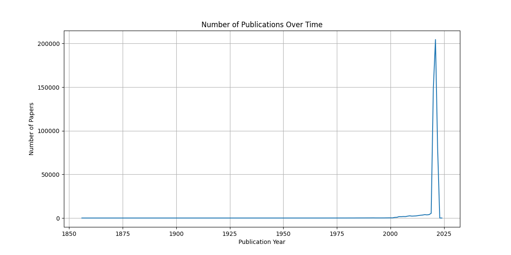
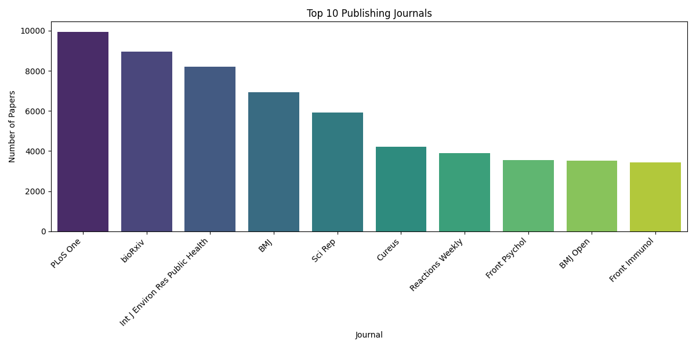
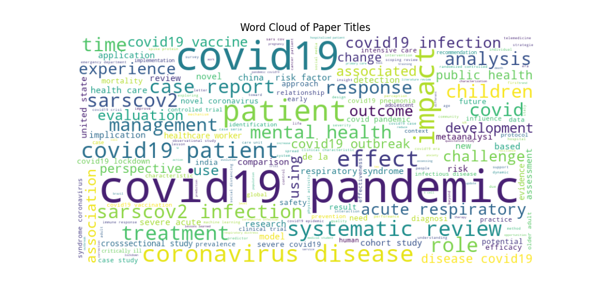
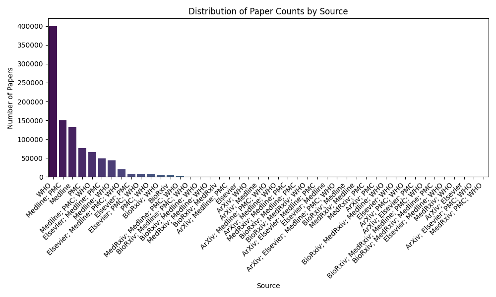

# COVID-19 Research Papers Analysis

## Project Overview
This project analyzes a large dataset of COVID-19 research papers to understand publication trends, identify key journals, and discover common research topics. The analysis includes visualizations of temporal trends, publication sources, and common themes in research titles.

## Dataset
The analysis uses the `metadata.csv` file which contains information about research papers related to COVID-19, including:
- Publication dates
- Journal names
- Paper titles
- Abstracts
- Authors
- DOIs and other identifiers

You can download the dataset from [Kaggle's CORD-19 Research Challenge](https://www.kaggle.com/datasets/allen-institute-for-ai/CORD-19-research-challenge?select=metadata.csv). After downloading, place the `metadata.csv` file in the project root directory.

## Key Findings

### 1. Publication Timeline

- Major surge in publications during 2020-2021
- Peak publication volume in 2021 with over 200,000 papers
- Continued high research activity through 2022
- Historical coverage dating back to 1856

### 2. Top Publishing Journals


Leading journals by publication volume:
1. PLoS One (9,953 papers)
2. bioRxiv (8,961 papers)
3. Int J Environ Res Public Health (8,201 papers)
4. BMJ (6,928 papers)
5. Scientific Reports (5,935 papers)
6. Cureus (4,212 papers)
7. Reactions Weekly (3,891 papers)
8. Frontiers in Psychology (3,541 papers)
9. BMJ Open (3,515 papers)
10. Frontiers in Immunology (3,442 papers)

### 3. Word Cloud Analysis


Most frequent terms in research titles:
- Primary COVID-related terms: "covid19", "pandemic", "sarscov2", "coronavirus"
- Medical terms: "patients", "health", "disease"
- Research-related terms: "study", "analysis"
- Common prepositions and articles are filtered out for clarity

### 4. Paper Counts by Source

- Shows the distribution of papers across different publication sources
- Demonstrates the diversity of research outlets
- Highlights the role of preprint servers and traditional journals

## Technical Implementation

### Tools and Libraries Used
- Python 3.x
- Pandas for data manipulation
- Matplotlib and Seaborn for visualization
- WordCloud for text analysis
- Streamlit for interactive web application

### Key Features
1. Data Cleaning and Preprocessing
   - Handling missing values
   - Date parsing and formatting
   - Text cleaning for analysis

2. Visualization Components
   - Time series analysis
   - Bar charts for top journals
   - Word cloud generation
   - Source distribution analysis

3. Interactive Web Application
   - Data exploration interface
   - Dynamic visualizations
   - Filtering capabilities
   - Detailed statistics view

## Running the Project

1. Install required packages:
```bash
pip install pandas numpy seaborn matplotlib wordcloud streamlit
```

2. Run the analysis script:
```bash
python covid.py
```

3. Launch the Streamlit app:
```bash
streamlit run app.py
```

## Data Insights

### Publication Trends
- Massive increase in research output during the pandemic
- Diverse range of publication venues
- Significant contribution from preprint servers

### Research Focus
- Strong emphasis on clinical studies
- Public health impact analysis
- Epidemiological research
- Treatment and prevention studies

### Publication Sources
- Mix of traditional journals and modern platforms
- Strong presence of open-access publications
- Important role of preprint servers in rapid information dissemination

## Future Work
1. Sentiment analysis of abstracts
2. Citation network analysis
3. Author collaboration networks
4. Geographic distribution of research
5. Topic modeling of full texts
6. Impact factor analysis

## Contributors
- [Bravin Vulimwa- Code4cities]

## License
[MIT]

---

*Note: This project is part of academic research and analysis of COVID-19 literature.*
